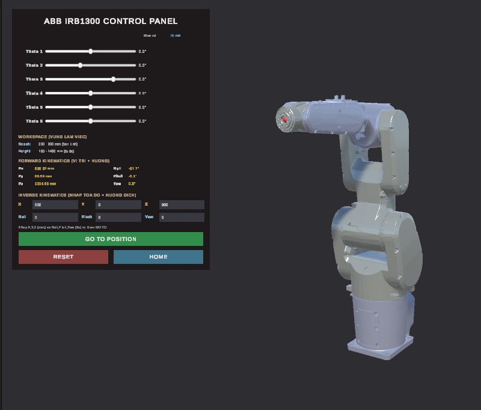
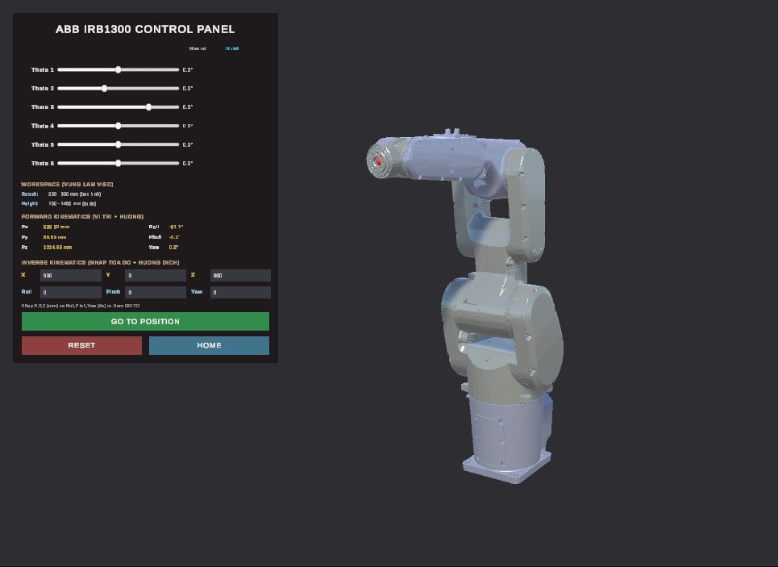
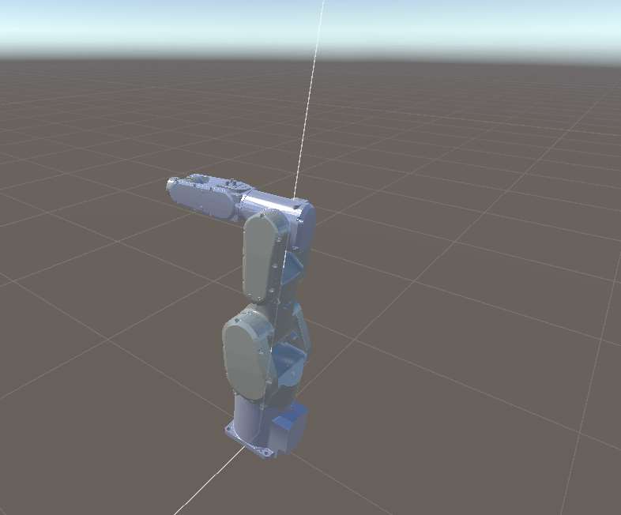
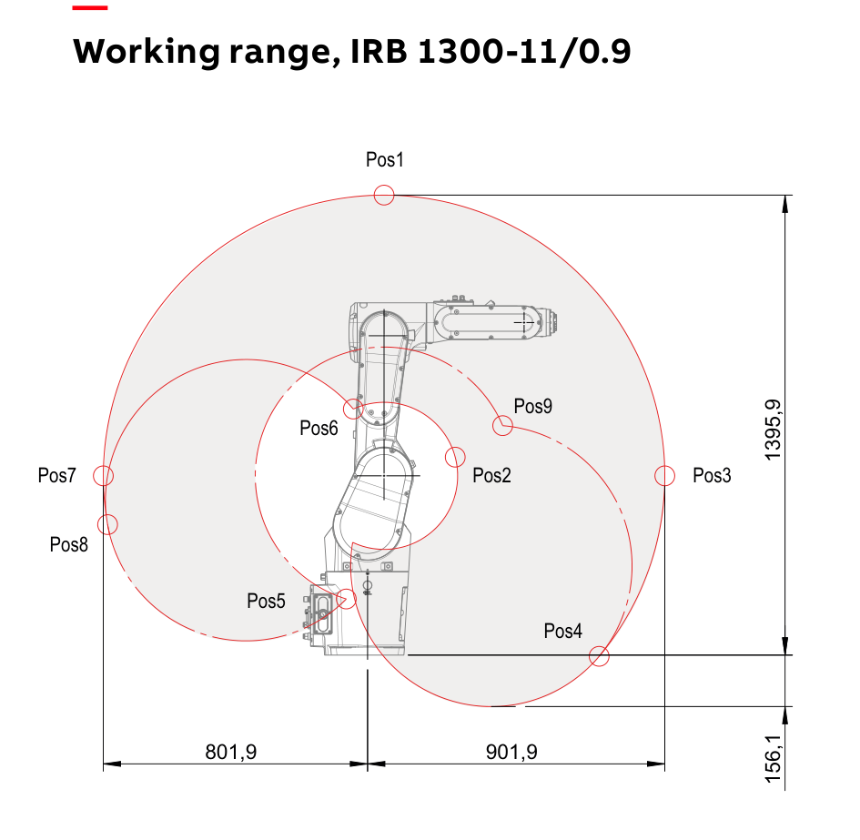

# Simulation robot IRB1300 on Unity

A Unity project that simulates the **ABB IRB 1300** six-axis industrial robot arm, with both forward and inverse kinematics.

Two main capabilities:

- **Forward Kinematics (FK):** drag six sliders to rotate each joint; the panel reports the tool-tip pose (X/Y/Z + Roll/Pitch/Yaw) in real time.
- **Inverse Kinematics (IK):** type a target pose, and the robot computes the six joint angles and moves there. After it stops, the actual end-effector pose is read back from the physics simulation and compared against the target, so the reported error is measured, not just claimed by the solver.

The arm is driven through Unity `ArticulationBody` joints with PD drives, rather than by rotating Transforms directly, so the motion behaves closer to a real servo-driven robot.

---

## Screenshots

Captured live in the Unity Editor:

<p align="center">
  
</p>

| Control panel + robot | Articulated joints (FK) |
|:---:|:---:|
|  |  |

The entire control panel (joint sliders, IK input fields, FK read-out, GO TO / HOME / RESET buttons) is built from code at runtime in `RobotUIBuilder.cs`, not laid out in the Editor.

---

## About the robot — ABB IRB 1300

This project simulates the **IRB 1300-11/0.9** variant (11 kg payload, 0.9 m reach). Key figures from the ABB data sheet:

| Specification | Value |
|---|---|
| Number of axes | 6 |
| Reach | 900 mm |
| Payload | 11 kg |
| Armload | 1 kg |
| Position repeatability (ISO 9283) | 0.02 mm |
| Path repeatability (ISO 9283) | 0.07 mm |
| Robot weight | 75 kg |
| Base footprint | 220 × 220 mm |
| Controller | ABB OmniCore |

### Axis working range and speed (data sheet, IRB 1300-11/0.9)

| Axis | Motion | Working range | Max speed |
|:---:|---|:---:|:---:|
| 1 | rotation | −180° … +180° | 280 °/s |
| 2 | arm | −100° … +130° | 228 °/s |
| 3 | arm | −210° … +65° | 336 °/s |
| 4 | wrist | −230° … +230° | 500 °/s |
| 5 | bend | −130° … +130° | 415 °/s |
| 6 | turn | −400° … +400° | 720 °/s |

### Joint limits used in the simulation

The limits actually enforced at runtime live in `RobotConfig.cs`:

```csharp
LowerLimits = { -180, -95, -210, -230, -130, -400 };  // degrees
UpperLimits = {  180, 155,   65,  230,  130,  400 };  // degrees
```

Note: axis 2 is given a wider range here (**−95° … +155°**, matching the longer-reach IRB 1300 variants) instead of the data-sheet **−100° … +130°** of the 11/0.9 model, to allow more test poses. Change those two lines to match the data sheet exactly if needed.

Two reference poses: **Home** `{0, −30, 30, 0, 60, 0}` and **Zero** (all joints = 0).

---

## Working range

Before solving IK, a target is accepted only if it lies inside the reachable envelope. The check (base frame, mm):

| Condition | Value |
|---|---|
| Planar radius `√(x²+y²)` | ≤ 900 mm |
| Height Z | 150 … 1450 mm |
| Distance to axis 2 `√(x²+y²+(z−544)²)` | ≤ 900 mm |

A target outside the envelope is rejected with the reason shown on the panel (radius exceeded / too low / too high).

Official working-range diagram from the ABB data sheet (IRB 1300-11/0.9):

<p align="center">
  
</p>

---

## Mathematics

### Coordinate frames

Unity works in metres with a left-handed frame; the robot maths runs in millimetres. Mapping from Unity local coordinates to the IK frame:

$$
\mathbf{p}_{IK} = (\,p_z,\; -p_x,\; p_y\,)\times 1000
$$

Tool orientation is expressed as **Roll–Pitch–Yaw** (ZYX). The tool approach vector is derived from RPY:

$$
\hat{\mathbf{a}} =
\begin{bmatrix}
\cos y \sin p \cos r + \sin y \sin r \\
\sin y \sin p \cos r - \cos y \sin r \\
\cos p \cos r
\end{bmatrix}
$$

### Forward kinematics

A classic Denavit–Hartenberg parameter table was tried first, but the measured DH constants did **not** match the rig in the scene — the analytic formula was systematically wrong. So FK is instead built directly from the anchor data of each `ArticulationBody`, read straight from the scene file. This was verified to agree to **0.00 mm / 0.0°** with the scene rest pose.

For each joint $i$, position $\mathbf{p}$ and rotation $R$ are accumulated:

$$
\mathbf{p} \leftarrow \mathbf{p} + R\,\mathbf{p}^{\,parent}_i,
\qquad
R \leftarrow R \; R^{\,parent}_i \; R_x(\theta_i)\; \big(R^{\,anchor}_i\big)^{-1}
$$

The flange position is then converted to the IK frame and offset by the tool length $d_6 = 90$ mm along the approach vector to reach the tool tip:

$$
\mathbf{p}_{tool} = \mathbf{p}_{flange} + d_6\,\hat{\mathbf{a}}
$$

> Because the internal FK follows the anchor data of the current scene, any change to the rig (added/removed links, changed dimensions) requires updating the `Anchors` array in `RobotKinematics.cs`, otherwise IK will drift.

### Inverse kinematics — Damped Least Squares

Since the analytic solution does not match the rig, IK is solved numerically by minimising the 6-D pose error (position + orientation) with **Damped Least Squares (Levenberg–Marquardt)**.

Error vector:

$$
\mathbf{e}=
\begin{bmatrix}
\mathbf{p}^{*}-\mathbf{p}(\boldsymbol\theta)\\[2pt]
w\,\boldsymbol\omega
\end{bmatrix}
$$

where $\boldsymbol\omega$ is the orientation error taken from the axis–angle of $R^{*}R(\boldsymbol\theta)^{-1}$, and $w = 300$ mm/rad balances the position (mm) and orientation (rad) scales.

The $6\times6$ Jacobian is computed by finite differences ($\epsilon = 0.05°$), then updated with an adaptive damping factor $\lambda$:

$$
\big(J J^{\top} + \lambda^{2} I\big)\,\mathbf{y} = \mathbf{e},
\qquad
\Delta\boldsymbol\theta = J^{\top}\mathbf{y}
$$

A step that lowers the cost decreases $\lambda$ (toward Gauss–Newton, faster convergence); a step that increases it raises $\lambda$ (toward gradient descent, more robust). The loop runs up to 200 iterations and stops when the error is ≤ 1 mm and ≤ 1°.

**Multi-start seeding:** numerical IK is prone to local minima and singularities, so LM is run from 9 different seeds (current angles, Home, Zero, and 6 random seeds within the joint limits). The converged solution **closest to the current configuration** is chosen for smoother motion; if no seed converges, the lowest-error solution is used as a fallback.

<p align="center">
  
</p>

### Real error verification

After the robot reaches the target, the code does **not** trust the solver result blindly. It waits a few physics steps for the joints to settle, then reads the actual end-effector position and orientation back from the `ArticulationBody` (already driven by the PD simulation) and compares them to the target. The panel shows the real measured error in mm/°, so a solver answer that the physics never actually reaches is exposed immediately.

---

## Code structure

Everything lives in `Assets/Scrips/`:

| File | Responsibility |
|---|---|
| `RobotConfig.cs` | Constants: joint limits, reach, Z limits, IK and drive parameters, reference poses. |
| `RobotKinematics.cs` | FK (physics read-back + internal anchor-based FK), numerical IK (LM/DLS), workspace check, frame mapping. |
| `RobotJointController.cs` | Main `MonoBehaviour`: joint drives, UI wiring, the solve-move-verify coroutine, markers. |
| `RobotUIBuilder.cs` | Builds the entire runtime UI from code (sliders, input fields, buttons, read-out panel). |

IK flow: read target → `IsInWorkspace` → `SolveIK` (9 seeds × LM) → `MoveTo` (smoothstep interpolation) → wait for physics to settle → read actual pose → report error.

---

## Controls

| Element | Function |
|---|---|
| 6 sliders `Theta 1..6` | Rotate each joint; the FK panel updates X/Y/Z + Roll/Pitch/Yaw instantly. |
| IK input fields | X, Y, Z (mm) and Roll, Pitch, Yaw (deg) of the tool tip. |
| **GO TO** | Workspace check → solve IK → move → report error. |
| **HOME** | Return to the Home pose. |
| **RESET** | Return to the Zero pose (all joints = 0). |
| Red sphere | Current tool-tip position. |
| Blue sphere | IK target point. |
| **F9** | Save a screenshot into `docs/`. |

---

## Running the project

Requires **Unity 2022.3** or newer (uses `ArticulationBody` + TextMeshPro).

```bash
git clone https://github.com/JohnNguyen205/Simulation-robot-IRB1300-on-Unity.git
```

1. Open the project with Unity Hub (Add → select the project folder).
2. Install **TextMeshPro Essentials** if Unity prompts for it.
3. Open the scene `Assets/Scenes/SampleScene.unity`.
4. Check that `RobotJointController` has all 6 `ArticulationBody` joints assigned (link_1 → link_6).
5. Press **Play**.

---

## Folder structure

```
.
├── Assets/
│   ├── Scenes/SampleScene.unity   simulation scene
│   ├── Scrips/                     C# source
│   │   ├── RobotConfig.cs
│   │   ├── RobotKinematics.cs
│   │   ├── RobotJointController.cs
│   │   └── RobotUIBuilder.cs
│   └── Materials/
├── Packages/
├── ProjectSettings/
├── docs/                           figures and screenshots
└── README.md
```

`Library/`, `Temp/`, `Logs/`, `.sln`, `.csproj` and similar Unity-generated files are excluded via `.gitignore`.

---

> Robot data is taken from the *ABB IRB 1300 Product Specification / data sheet*, and the working-range diagram is reproduced from it. ABB and IRB 1300 are trademarks of ABB. This project is for educational use only and is not affiliated with ABB.
