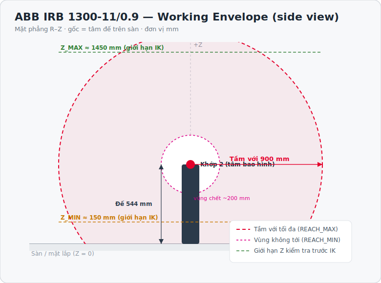
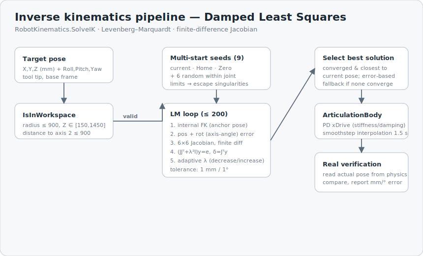

# Mô phỏng Động học & Động học nghịch — Robot ABB IRB 1300 trên Unity

> **Simulate kinematics and inverse kinematics of robot ABB IRB 1300 on Unity**

Mô phỏng tương tác một cánh tay robot công nghiệp 6 bậc tự do **ABB IRB 1300-11/0.9** trong Unity: điều khiển thuận từng khớp (Forward Kinematics), giải động học nghịch (Inverse Kinematics) bằng phương pháp số để đưa mũi công cụ tới một tư thế đích (vị trí + hướng), kiểm tra vùng làm việc và **xác minh sai số thật** trên mô phỏng vật lý `ArticulationBody`.

<p align="center">
  
</p>


---

## Mục lục

- [Tính năng](#tính-năng)
- [Ảnh mô phỏng](#ảnh-mô-phỏng)
- [Thông số robot ABB IRB 1300](#thông-số-robot-abb-irb-1300)
- [Kích thước & phạm vi hoạt động](#kích-thước--phạm-vi-hoạt-động)
- [Giới hạn khớp](#giới-hạn-khớp)
- [Cơ sở toán học](#cơ-sở-toán-học)
  - [Hệ tọa độ & quy ước](#1-hệ-tọa-độ--quy-ước)
  - [Động học thuận (FK)](#2-động-học-thuận-fk)
  - [Ràng buộc vùng làm việc](#3-ràng-buộc-vùng-làm-việc)
  - [Động học nghịch (IK)](#4-động-học-nghịch-ik--damped-least-squares)
- [Kiến trúc mã nguồn](#kiến-trúc-mã-nguồn)
- [Điều khiển & cách dùng](#điều-khiển--cách-dùng)
- [Cài đặt & chạy](#cài-đặt--chạy)
- [Cấu trúc thư mục](#cấu-trúc-thư-mục)
- [Giới hạn đã biết](#giới-hạn-đã-biết)
- [Tác giả](#tác-giả)

---

## Tính năng

- **Điều khiển thuận (FK):** 6 thanh trượt jog từng khớp; đọc trực tiếp tư thế mũi công cụ (X/Y/Z + Roll/Pitch/Yaw) theo thời gian thực.
- **Động học nghịch (IK):** nhập tư thế đích → robot tự tính góc 6 khớp và di chuyển tới, nội suy mượt `smoothstep`.
- **Giải IK bằng số, đa điểm xuất phát:** Damped Least Squares (Levenberg–Marquardt) với Jacobian sai phân hữu hạn, 9 seed để tránh cực tiểu địa phương và vùng kỳ dị.
- **Kiểm tra vùng làm việc** trước khi giải: bán kính, giới hạn Z, khoảng cách tới trục 1.
- **Xác minh sai số thật:** sau khi robot dừng, đọc lại tư thế thực từ `ArticulationBody` (đã mô phỏng vật lý PD) và so với đích — báo sai số mm/°, không tin mù vào lời giải.
- **Mô phỏng vật lý** bằng `ArticulationBody` + xDrive (stiffness/damping), sát hành vi servo thật.
- Đánh dấu trực quan: cầu đỏ = mũi công cụ, cầu xanh = điểm đích.

---

## Ảnh mô phỏng

Sơ đồ vùng làm việc và pipeline thuật toán ở các mục dưới được vẽ sẵn (SVG). Để thêm **ảnh chụp màn hình Unity**: bỏ ảnh vào `docs/` (ví dụ `docs/screenshot-fk.png`, `docs/screenshot-ik.png`) rồi bỏ dấu chú thích ở khối dưới.

<!-- Thêm ảnh chụp thật rồi bỏ cặp thẻ comment này:
| Điều khiển thuận (FK) | Động học nghịch (IK) |
|:---:|:---:|
|  |  |
-->

<p align="center">
  
</p>

---

## Thông số robot ABB IRB 1300

Dự án mô phỏng biến thể **IRB 1300-11/0.9** (tải 11 kg, tầm với 0.9 m). Toàn họ IRB 1300:

| Biến thể | Tầm với | Tải trọng | Armload |
|---|---:|---:|---:|
| **IRB 1300-11/0.9** *(dùng trong dự án)* | 900 mm | 11 kg | 1.0 kg |
| IRB 1300-10/1.15 | 1150 mm | 10 kg | 0.5 kg |
| IRB 1300-7/1.4 | 1400 mm | 7 kg | 0.5 kg |

| Đặc tính | Giá trị |
|---|---|
| Số bậc tự do | 6 |
| Độ lặp lại vị trí (ISO 9283) | 0.02 mm |
| Khối lượng robot | ~75 kg |
| Bộ điều khiển | ABB OmniCore |
| Kiểu lắp | Sàn / nghiêng / treo |

---

## Kích thước & phạm vi hoạt động

Chuyển động và tốc độ tối đa từng trục — **datasheet ABB IRB 1300-11/0.9**:

| Trục | Tên | Working range | Tốc độ tối đa |
|:---:|---|:---:|:---:|
| Axis 1 | rotation (thân) | +180° … −180° | 280 °/s |
| Axis 2 | arm (vai) | +130° … −100° | 228 °/s |
| Axis 3 | arm (khuỷu) | +65° … −210° | 330 °/s |
| Axis 4 | wrist (xoay cổ) | +230° … −230° | 500 °/s |
| Axis 5 | bend (gập cổ) | +130° … −130° | 420 °/s |
| Axis 6 | turn (mặt bích) | +400° … −400° | 720 °/s |

Bao hình vùng làm việc (mô phỏng, hệ base_link, đơn vị mm):

| Tham số | Ký hiệu | Giá trị |
|---|:---:|---:|
| Tầm với tối đa | `REACH_MAX` | 900 mm |
| Vùng chết trong | `REACH_MIN` | 200 mm |
| Chiều cao đế (tới khớp 2) | `BASE_HEIGHT` | 544 mm |
| Giới hạn Z dưới | `Z_MIN` | 150 mm |
| Giới hạn Z trên | `Z_MAX` | 1450 mm |
| Bù mặt bích → mũi tool | `D6` | 90 mm |

<p align="center">
  
</p>

> ⚠️ Trục 2 trong mô phỏng dùng dải **+155°…−95°** (theo bản reach 1.15/1.4 của cùng họ) thay vì +130°…−100° của datasheet 11/0.9. Giá trị thực thi lấy từ `RobotConfig.cs` là nguồn sự thật cho phần mô phỏng.

---

## Giới hạn khớp

Giá trị enforce trong mô phỏng — `Assets/Scrips/RobotConfig.cs`:

```csharp
LowerLimits = { -180, -95, -210, -230, -130, -400 };  // độ
UpperLimits = {  180, 155,   65,  230,  130,  400 };  // độ
```

| Trục | Dưới | Trên | Dải |
|:---:|---:|---:|---:|
| 1 | −180° | +180° | 360° |
| 2 | −95° | +155° | 250° |
| 3 | −210° | +65° | 275° |
| 4 | −230° | +230° | 460° |
| 5 | −130° | +130° | 260° |
| 6 | −400° | +400° | 800° |

Tư thế mốc: **Home** `{0, −30, 30, 0, 60, 0}` · **Zero** `{0, 0, 0, 0, 0, 0}`.

---

## Cơ sở toán học

### 1. Hệ tọa độ & quy ước

Mô phỏng dùng hai hệ và ánh xạ giữa Unity (m, hệ trái) và hệ IK của robot (mm):

$$
\mathbf{p}_{IK} = (\,p_z,\; -p_x,\; p_y\,)\times 1000
\qquad\text{(Unity local } \to \text{ IK mm)}
$$

Hướng mũi công cụ biểu diễn bằng **Roll–Pitch–Yaw** (quy ước ZYX). Vector hướng tiến (approach) của tool suy từ RPY:

$$
\hat{\mathbf{a}} =
\begin{bmatrix}
\cos y \sin p \cos r + \sin y \sin r \\
\sin y \sin p \cos r - \cos y \sin r \\
\cos p \cos r
\end{bmatrix}
$$

### 2. Động học thuận (FK)

Thay cho tham số DH cổ điển (đã kiểm chứng **không** khớp rig thật), FK dựng trực tiếp từ dữ liệu neo (`anchor`) của từng `ArticulationBody` đọc từ scene — đã verify khớp **0.0000° / 0.00 mm** với rest-pose. Với mỗi khớp $i$, tích lũy vị trí $\mathbf{p}$ và quay $R$:

$$
\mathbf{p} \leftarrow \mathbf{p} + R\,\mathbf{p}^{\,parent}_i,
\qquad
R \leftarrow R \; R^{\,parent}_i \; R_x(\theta_i)\; \big(R^{\,anchor}_i\big)^{-1}
$$

trong đó $R_x(\theta_i)$ là phép quay quanh trục khớp một góc $\theta_i$. Vị trí mặt bích (flange) đổi sang hệ IK, rồi bù đoạn tool dọc hướng approach:

$$
\mathbf{p}_{tool} = \mathbf{p}_{flange} + d_6\,\hat{\mathbf{a}},
\qquad d_6 = 90\ \text{mm}
$$

### 3. Ràng buộc vùng làm việc

Trước khi giải IK, tư thế đích $(x,y,z)$ phải thỏa (với $D_1 = 544$ mm là chiều cao khớp 2):

$$
r=\sqrt{x^2+y^2}\le 900,
\qquad
150 \le z \le 1450,
\qquad
\sqrt{x^2+y^2+(z-D_1)^2}\le 900
$$

### 4. Động học nghịch (IK) — Damped Least Squares

Bài toán tối thiểu bình phương sai số tư thế 6 chiều (vị trí + hướng):

$$
\min_{\boldsymbol\theta}\;\tfrac12\lVert \mathbf{e}(\boldsymbol\theta)\rVert^2,
\qquad
\mathbf{e}=
\begin{bmatrix}
\mathbf{p}^{*}-\mathbf{p}(\boldsymbol\theta)\\[2pt]
w\,\boldsymbol\omega
\end{bmatrix}
$$

Sai số hướng $\boldsymbol\omega$ lấy từ **axis–angle** của $R^{*}R(\boldsymbol\theta)^{-1}$; trọng số $w = 300\ \text{mm/rad}$ để cân thang đo vị trí và hướng.

**Jacobian** $6\times6$ tính bằng sai phân hữu hạn ($\epsilon = 0.05°$):

$$
J_{:,j} \approx \frac{\mathbf{e}(\boldsymbol\theta+\epsilon\,\mathbf{u}_j)-\mathbf{e}(\boldsymbol\theta)}{\epsilon}
$$

**Cập nhật Levenberg–Marquardt** (damped least squares) với hệ số giảm chấn thích nghi $\lambda$:

$$
\big(J J^{\top} + \lambda^{2} I\big)\,\mathbf{y} = \mathbf{e},
\qquad
\Delta\boldsymbol\theta = J^{\top}\mathbf{y},
\qquad
\boldsymbol\theta \leftarrow \boldsymbol\theta + \Delta\boldsymbol\theta
$$

Nếu bước làm giảm chi phí thì $\lambda \!\downarrow$ (tiến gần Gauss–Newton), ngược lại $\lambda \!\uparrow$ (tiến về gradient descent). Lặp tối đa 200 vòng, dừng khi sai số $\le 1\ \text{mm}$ và $\le 1°$.

**Đa điểm xuất phát:** chạy LM từ 9 seed (góc hiện tại, Home, Zero, 6 seed ngẫu nhiên trong giới hạn khớp), chọn nghiệm hội tụ **gần cấu hình hiện tại nhất** để chuyển động mượt; nếu không seed nào hội tụ thì lấy nghiệm sai số nhỏ nhất làm fallback.

<p align="center">
  
</p>

---

## Kiến trúc mã nguồn

`Assets/Scrips/`

| File | Vai trò |
|---|---|
| `RobotConfig.cs` | Hằng số: giới hạn khớp, tầm với, giới hạn Z, tham số IK & drive, tư thế mốc. |
| `RobotKinematics.cs` | FK (đọc physics + FK nội bộ theo anchor), IK số (LM/DLS), kiểm tra vùng làm việc, ánh xạ hệ tọa độ. |
| `RobotJointController.cs` | `MonoBehaviour` chính: gắn drive, nối UI, coroutine giải-di chuyển-xác minh, marker EE/target. |
| `RobotUIBuilder.cs` | Dựng UI runtime: slider khớp, ô nhập IK, nút GO TO / HOME / RESET, panel hiển thị tư thế. |

**Luồng IK:** nhập đích → `IsInWorkspace` → `SolveIK` (đa seed × LM) → `MoveTo` (nội suy PD drive) → chờ physics ổn định → đọc lại pose thật → báo sai số.

---

## Điều khiển & cách dùng

| Thành phần | Chức năng |
|---|---|
| **6 Slider khớp** | Jog thuận từng trục; panel hiển thị X/Y/Z + Roll/Pitch/Yaw cập nhật realtime. |
| **Ô nhập IK** | X, Y, Z (mm) và Roll, Pitch, Yaw (độ) của mũi tool. |
| **GO TO** | Kiểm tra vùng làm việc → giải IK → di chuyển → xác minh sai số. |
| **HOME** | Về tư thế Home `{0,−30,30,0,60,0}`. |
| **RESET** | Về tư thế Zero (tất cả khớp = 0). |
| 🔴 Cầu đỏ | Vị trí mũi công cụ hiện tại. |
| 🔵 Cầu xanh | Điểm đích IK. |

---

## Cài đặt & chạy

**Yêu cầu:** Unity **2022.x trở lên** (dùng `ArticulationBody` + TextMeshPro).

```bash
git clone https://github.com/JohnNguyen205/simulate-kinematics-and-inverse-kinematics-of-robot-ABB-IRB1300-on-Unity.git
```

1. Mở project bằng **Unity Hub** (Add → chọn thư mục).
2. Nếu được hỏi, cài **TextMeshPro Essentials**.
3. Mở scene `Assets/Scenes/SampleScene.unity`.
4. Kiểm tra component `RobotJointController` đã gán đủ 6 `ArticulationBody` (link_1 → link_6).
5. Nhấn **Play**.

---

## Cấu trúc thư mục

```
.
├── Assets/
│   ├── Scenes/SampleScene.unity     # scene mô phỏng
│   ├── Scrips/                       # mã nguồn C#
│   │   ├── RobotConfig.cs
│   │   ├── RobotKinematics.cs
│   │   ├── RobotJointController.cs
│   │   └── RobotUIBuilder.cs
│   └── Materials/
├── Packages/                         # Unity package manifest
├── ProjectSettings/                  # cấu hình project
├── docs/                             # ảnh minh họa (SVG)
└── README.md
```

> `Library/`, `Temp/`, `Logs/`, `obj/`, file `.sln`/`.csproj` do Unity tự sinh — đã loại qua `.gitignore`.

---

## Giới hạn đã biết

- IK số phụ thuộc điểm xuất phát; vùng gần kỳ dị có thể cần nhiều seed hơn. Đã báo trung thực khi không hội tụ.
- FK nội bộ hiệu chỉnh theo **anchor** của scene hiện tại; nếu đổi rig phải cập nhật lại mảng `Anchors`.
- Trục 2 dùng dải rộng hơn datasheet 11/0.9 (xem ghi chú trên).
- Chưa mô phỏng va chạm self-collision giữa các link.

---

## Tác giả

- **JohnNguyen205** — https://github.com/JohnNguyen205

Đồ án mô phỏng động học & động học nghịch robot công nghiệp trên Unity.

> Số liệu robot theo *ABB IRB 1300 Product Specification / Data Sheet*. ABB và IRB 1300 là thương hiệu của ABB; dự án chỉ dùng cho mục đích học tập, không liên kết với ABB.
